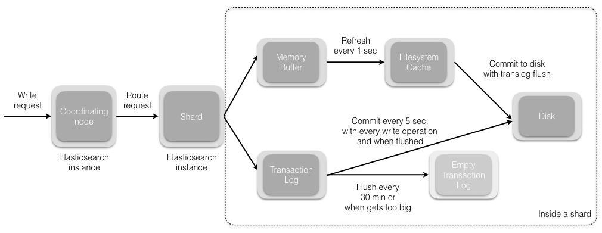

# ElasticSearch的面试问题收录

[TOC]

## 1.为什么要使用Elasticsearch?

​		在没有es或者其他搜索引擎之前, 我们对一个关键字进行搜索, 都是用关系型数据库的模糊查询的(like), 随着数据量的增长,效率会急速的降低. 

		1. es会对全文进行分词和索引(有了这个可以做同义词搜索等数据库解决不了的搜索问题)
  		2. 根据程序员自定义的规则对查询的关键词进行权重打分.
  		3. 从设计之初就支持分布式(分布式的优点).
  		4. 通过倒排索引的方式来建立关键字到全文的映射关系来解决传统数据的全表扫描,极大的优化了查询的吞吐和速度.

## 2.Elasticsearch是如何实现Master选举的？

- Elasticsearch的选主是ZenDiscovery模块负责的，主要包含Ping（节点之间通过这个RPC来发现彼此）和Unicast（单播模块包含一个主机列表以控制哪些节点需要ping通）这两部分；
- 对所有可以成为master的节点（**node.master: true**）根据nodeId字典排序，每次选举每个节点都把自己所知道节点排一次序，然后选出第一个（第0位）节点，暂且认为它是master节点。
- 如果对某个节点的投票数达到一定的值（可以成为master节点数n/2+1）并且该节点自己也选举自己，那这个节点就是master。否则重新选举一直到满足上述条件。
- *补充：master节点的职责主要包括集群、节点和索引的管理，不负责文档级别的管理；data节点可以关闭http功能*

## 3.Elasticsearch中的节点（比如共20个），其中的10个选了一个master，另外10个选了另一个master，怎么办？

- 当集群master候选数量不小于3个时，可以通过设置最少投票通过数量（**discovery.zen.minimum_master_nodes**）超过所有候选节点一半以上来解决脑裂问题；
- 当候选数量为两个时，只能修改为唯一的一个master候选，其他作为data节点，避免脑裂问题。

## 4.客户端在和集群连接时，如何选择特定的节点执行请求的？

​		TransportClient利用transport模块远程连接一个elasticsearch集群。它并不加入到集群中，只是简单的获得一个或者多个初始化的transport地址，并以 **轮询** 的方式与这些地址进行通信。

## 5. 详细描述一下Elasticsearch索引文档的过程。

​		协调节点默认使用文档ID参与计算（也支持通过routing），以便为路由提供合适的分片。

```Java
shard = hash(document_id) % (num_of_primary_shards)
```

- 当分片所在的节点接收到来自协调节点的请求后，会将请求写入到Memory Buffer，然后定时（默认是每隔1秒）写入到Filesystem Cache，这个从Momery Buffer到Filesystem Cache的过程就叫做refresh；
- 当然在某些情况下，存在Momery Buffer和Filesystem Cache的数据可能会丢失，ES是通过translog的机制来保证数据的可靠性的。其实现机制是接收到请求后，同时也会写入到translog中，当Filesystem cache中的数据写入到磁盘中时，才会清除掉，这个过程叫做flush；
- 在flush过程中，内存中的缓冲将被清除，内容被写入一个新段，段的fsync将创建一个新的提交点，并将内容刷新到磁盘，旧的translog将被删除并开始一个新的translog。
- flush触发的时机是定时触发（默认30分钟）或者translog变得太大（默认为512M）时；

[](https://upload-images.jianshu.io/upload_images/3709321-2084bd0268a42ae1.jpeg?imageMogr2/auto-orient/strip|imageView2/2/w/1240)

*补充：关于Lucene的Segement：*

- Lucene索引是由多个段组成，段本身是一个功能齐全的倒排索引。
- 段是不可变的，允许Lucene将新的文档增量地添加到索引中，而不用从头重建索引。
- 对于每一个搜索请求而言，索引中的所有段都会被搜索，并且每个段会消耗CPU的时钟周、文件句柄和内存。这意味着段的数量越多，搜索性能会越低。
- 为了解决这个问题，Elasticsearch会合并小段到一个较大的段，提交新的合并段到磁盘，并删除那些旧的小段。

## 5.详细描述一下Elasticsearch更新和删除文档的过程

　　删除和更新也都是写操作，但是Elasticsearch中的文档是不可变的，因此不能被删除或者改动以展示其变更；
　　磁盘上的每个段都有一个相应的.del文件。当删除请求发送后，文档并没有真的被删除，而是在.del文件中被标记为删除。该文档依然能匹配查询，但是会在结果中被过滤掉。当段合并时，在.del文件中被标记为删除的文档将不会被写入新段。
　　在新的文档被创建时，Elasticsearch会为该文档指定一个版本号，当执行更新时，旧版本的文档在.del文件中被标记为删除，新版本的文档被索引到一个新段。旧版本的文档依然能匹配查询，但是会在结果中被过滤掉。

## 6.详细描述一下Elasticsearch搜索的过程

　　搜索被执行成一个两阶段过程，我们称之为 Query Then Fetch；
　　在初始查询阶段时，查询会广播到索引中每一个分片拷贝（主分片或者副本分片）。 每个分片在本地执行搜索并构建一个匹配文档的大小为 from + size 的优先队列。PS：在搜索的时候是会查询Filesystem Cache的，但是有部分数据还在Memory Buffer，所以搜索是近实时的。
　　每个分片返回各自优先队列中 所有文档的 ID 和排序值 给协调节点，它合并这些值到自己的优先队列中来产生一个全局排序后的结果列表。
　　接下来就是 取回阶段，协调节点辨别出哪些文档需要被取回并向相关的分片提交多个 GET 请求。每个分片加载并 丰富 文档，如果有需要的话，接着返回文档给协调节点。一旦所有的文档都被取回了，协调节点返回结果给客户端。
　　补充：Query Then Fetch的搜索类型在文档相关性打分的时候参考的是本分片的数据，这样在文档数量较少的时候可能不够准确，DFS Query Then Fetch增加了一个预查询的处理，询问Term和Document frequency，这个评分更准确，但是性能会变差。

### 9.Elasticsearch对于大数据量（上亿量级）的聚合如何实现？

 　　Elasticsearch 提供的首个近似聚合是cardinality 度量。它提供一个字段的基数，即该字段的distinct或者unique值的数目。它是基于HLL算法的。HLL 会先对我们的输入作哈希运算，然后根据哈希运算的结果中的 bits 做概率估算从而得到基数。其特点是：可配置的精度，用来控制内存的使用（更精确 ＝ 更多内存）；小的数据集精度是非常高的；我们可以通过配置参数，来设置去重需要的固定内存使用量。无论数千还是数十亿的唯一值，内存使用量只与你配置的精确度相关 .

### 10.在并发情况下，Elasticsearch如果保证读写一致？

　　可以通过版本号使用乐观并发控制，以确保新版本不会被旧版本覆盖，由应用层来处理具体的冲突；
　　另外对于写操作，一致性级别支持quorum/one/all，默认为quorum，即只有当大多数分片可用时才允许写操作。但即使大多数可用，也可能存在因为网络等原因导致写入副本失败，这样该副本被认为故障，分片将会在一个不同的节点上重建。
　　对于读操作，可以设置replication为sync(默认)，这使得操作在主分片和副本分片都完成后才会返回；如果设置replication为async时，也可以通过设置搜索请求参数_preference为primary来查询主分片，确保文档是最新版本。

### 14.ElasticSearch中的集群、节点、索引、文档、类型是什么？

　　群集是一个或多个节点（服务器）的集合，它们共同保存您的整个数据，并提供跨所有节点的联合索引和搜索功能。群集由唯一名称标识，默认情况下为“elasticsearch”。此名称很重要，因为如果节点设置为按名称加入群集，则该节点只能是群集的一部分。
　　节点是属于集群一部分的单个服务器。它存储数据并参与群集索引和搜索功能。
　　索引就像关系数据库中的“数据库”。它有一个定义多种类型的映射。索引是逻辑名称空间，映射到一个或多个主分片，并且可以有零个或多个副本分片。 MySQL =>数据库 　　     ElasticSearch =>索引
　　文档类似于关系数据库中的一行。不同之处在于索引中的每个文档可以具有不同的结构（字段），但是对于通用字段应该具有相同的数据类型。 MySQL => Databases => 　       Tables => Columns / Rows ElasticSearch => Indices => Types =>具有属性的文档
　　类型是索引的逻辑类别/分区，其语义完全取决于用户。

### 15.ElasticSearch中的分片是什么?

　　在大多数环境中，每个节点都在单独的盒子或虚拟机上运行。

　　索引 - 在Elasticsearch中，索引是文档的集合。
　　分片 -因为Elasticsearch是一个分布式搜索引擎，所以索引通常被分割成分布在多个节点上的被称为分片的元素。

### 16.什么是ElasticSearch？ 

Elasticsearch是一个基于Lucene的搜索引擎。它提供了具有HTTP Web界面和无架构JSON文档的分布式，多租户能力的全文搜索引擎。Elasticsearch是用Java开发的，根据Apache许可条款作为开源发布。

### 17.Elasticsearch中的倒排索引是什么？ 

倒排索引是搜索引擎的核心。搜索引擎的主要目标是在查找发生搜索条件的文档时提供快速搜索。倒排索引是一种像数据结构一样的散列图，可将用户从单词导向文档或网页。它是搜索引擎的核心。其主要目标是快速搜索从数百万文件中查找数据。 

### 18.ElasticSearch中的集群、节点、索引、文档、类型是什么？

- 群集是一个或多个节点（服务器）的集合，它们共同保存您的整个数据，并提供跨所有节点的联合索引和搜索功能。群集由唯一名称标识，默认情况下为“elasticsearch”。此名称很重要，因为如果节点设置为按名称加入群集，则该节点只能是群集的一部分。
- 节点是属于集群一部分的单个服务器。它存储数据并参与群集索引和搜索功能。
- 索引就像关系数据库中的“数据库”。它有一个定义多种类型的映射。索引是逻辑名称空间，映射到一个或多个主分片，并且可以有零个或多个副本分片。 MySQL =>数据库 ElasticSearch =>索引
- 文档类似于关系数据库中的一行。不同之处在于索引中的每个文档可以具有不同的结构（字段），但是对于通用字段应该具有相同的数据类型。 MySQL => Databases => Tables => Columns / Rows ElasticSearch => Indices => Types =>具有属性的文档
- 类型是索引的逻辑类别/分区，其语义完全取决于用户。

### 19.ElasticSearch是否有架构？

ElasticSearch可以有一个架构。架构是描述文档类型以及如何处理文档的不同字段的一个或多个字段的描述。Elasticsearch中的架构是一种映射，它描述了JSON文档中的字段及其数据类型，以及它们应该如何在Lucene索引中进行索引。因此，在Elasticsearch术语中，我们通常将此模式称为“映射”。 

Elasticsearch具有架构灵活的能力，这意味着可以在不明确提供架构的情况下索引文档。如果未指定映射，则默认情况下，Elasticsearch会在索引期间检测文档中的新字段时动态生成一个映射。

### 20.ElasticSearch中的分片是什么？ 

在大多数环境中，每个节点都在单独的盒子或虚拟机上运行。 

- 索引 - 在Elasticsearch中，索引是文档的集合。 
- 分片 -因为Elasticsearch是一个分布式搜索引擎，所以索引通常被分割成分布在多个节点上的被称为分片的元素。

### 21.ElasticSearch中的副本是什么？

一个索引被分解成碎片以便于分发和扩展。副本是分片的副本。一个节点是一个属于一个集群的ElasticSearch的运行实例。一个集群由一个或多个共享相同集群名称的节点组成。 

### 22.ElasticSearch中的分析器是什么？

在ElasticSearch中索引数据时，数据由为索引定义的Analyzer在内部进行转换。 分析器由一个Tokenizer和零个或多个TokenFilter组成。编译器可以在一个或多个CharFilter之前。分析模块允许您在逻辑名称下注册分析器，然后可以在映射定义或某些API中引用它们。

Elasticsearch附带了许多可以随时使用的预建分析器。或者，您可以组合内置的字符过滤器，编译器和过滤器器来创建自定义分析器。

### 23.什么是ElasticSearch中的编译器？

编译器用于将字符串分解为术语或标记流。一个简单的编译器可能会将字符串拆分为任何遇到空格或标点的地方。Elasticsearch有许多内置标记器，可用于构建自定义分析器。

### 24.启用属性，索引和存储的用途是什么？

enabled属性适用于各类ElasticSearch特定/创建领域，如index和size。用户提供的字段没有“已启用”属性。 存储意味着数据由Lucene存储，如果询问，将返回这些数据。

存储字段不一定是可搜索的。默认情况下，字段不存储，但源文件是完整的。因为您希望使用默认值(这是有意义的)，所以不要设置store属性 该指数属性用于搜索。

索引属性只能用于搜索。只有索引域可以进行搜索。差异的原因是在分析期间对索引字段进行了转换，因此如果需要的话，您不能检索原始数据。